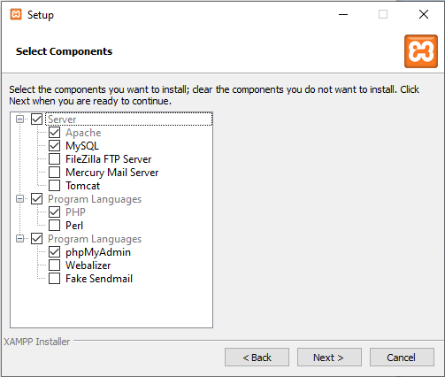
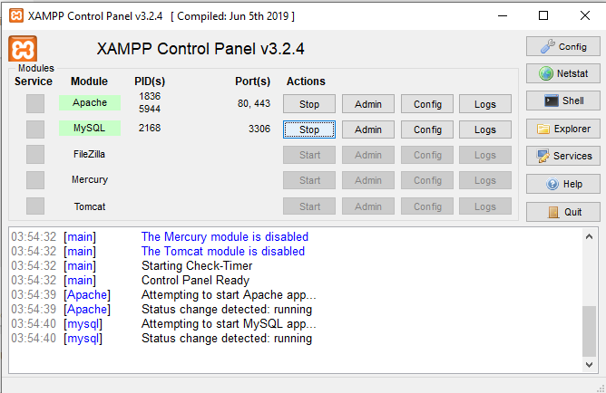
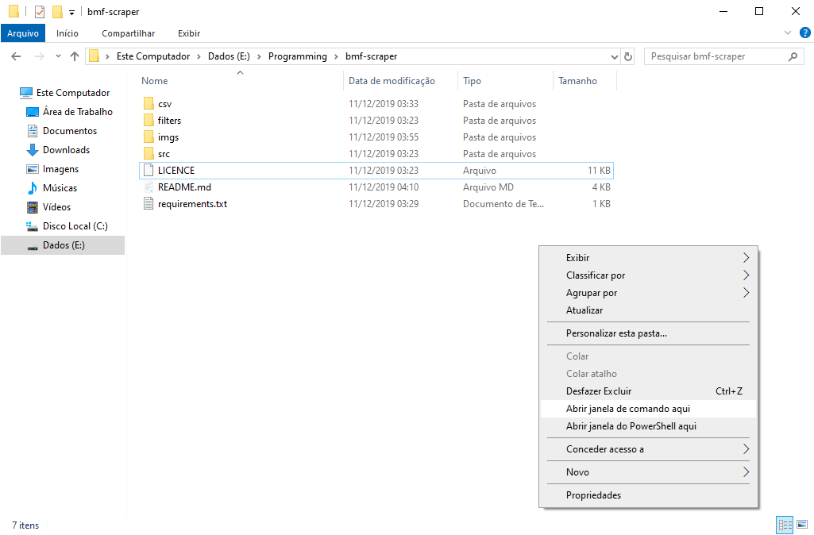
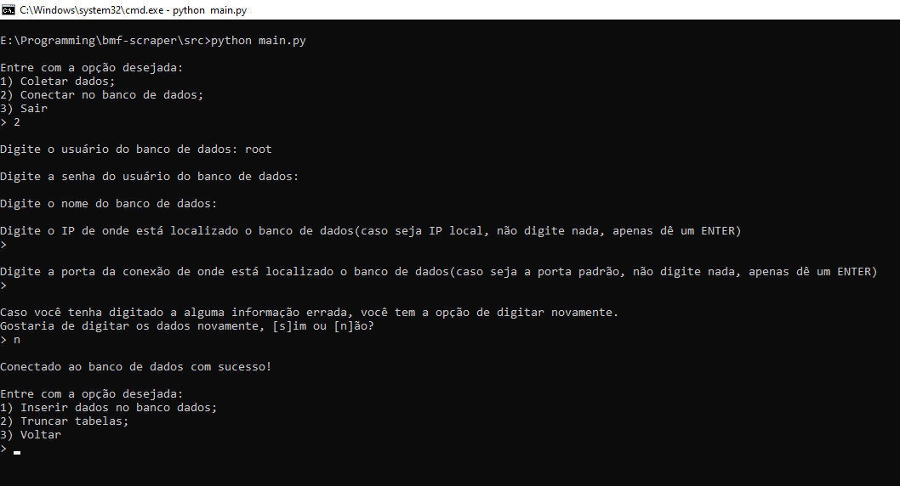
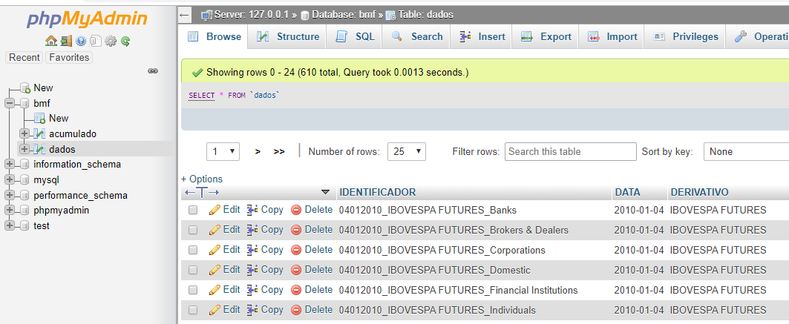

# Scraper BMF

## Descrição
Este projeto consiste em coletar os dados do site http://www2.bmf.com.br/pages/portal/bmfbovespa/lumis/lum-tipo-de-participante-enUS.asp a partir de um intervalo de data determinado pelo usuário. Os dados que serão coletados também dependem dos contratos que o usuário escrever no arquivo [contract.txt](filters/contract.txt), ou seja, os dados que serão coletados serão filtrados por meio deste arquivo. Após a coleta, os dados serão gravados em arquivos **.csv**, cada arquivo será separado por contrato(que foram escritos no filtro) e estes serão salvos por padrão no diretório [csv/](csv/) e dentro deste, há uma pasta nomeada de *ACCUMULATED*, nesta pasta também contem arquivos .csv, contendo o saldo acumulado desde a data inicial até a final.

O usuário terá opção de armazenar os dados num banco de dados **MySQL 5.7**, seja este local ou remoto. A disposição dos dados nos banco está em duas tabelas, `dados` e `acumulado`, onde nestas contém todos os dados dos contratantes e o saldo acumulado, respectivamente.

As tabelas estão ligadas por uma chave estregeira, onde esta está nomeada de `IDENTIFICADOR` e localizada na tabela *dados*, que é a tabela principal do banco.

---
## Requisitos

**OBS: Caso algum passo da instalação não esteja numa imagem, basta avançar!**

* `Python - versão 3.7.3 (Testado)` - [Download](https://www.python.org/ftp/python/3.7.3/python-3.7.3-amd64.exe)
    * Para instalar o Python de forma correta, basta fazer o Download e na tela inicial, marcar o checkbox "Add Python 3.7 to PATH" e clicar em "Install Now"
    
* `pip (Gerenciador de pacotes do Python)` - o pip já será instalado ao realizar a instalação dessa forma.

* `MySQL 5.7 (Testado)` - [Download](https://www.apachefriends.org/xampp-files/7.3.12/xampp-windows-x64-7.3.12-0-VC15-installer.exe)
    * Para instalar o MySQL de forma correta, basta fazer o Download do XAMPP e marcar as mesmas opções das imagens abaixo.
    

Ao instalar o XAMPP dessa forma, é preciso iniciar os serviços do Apache e do MySQL, para isso, basta abrir o painel do XAMPP, e marcar as opções abaixo.

Dessa forma, seu ambiente já está pronto para armazenar os dados no banco!

### Configuração de login padrão

Ao realizar a instalação dessa forma, o XAMPP configura esse usuário e senha padrão de utilização.

* `usuário = root`
* `senha = ""` - Na execução do programa, basta pressionar um ENTER!

---
## Dependências

Para instalar as dependências, abra PowerShell/prompt de comando no diretório corrente e execute o comando abaixo:

* `python -m pip install -r requirements.txt --user`

**OBS: Para abrir uma janela de comando no diretório corrente, segure a tecla `Shift` e clique com o botão direito do mouse em algum ponto do espaço da pasta, após isso, clique na opção "Abrir janela de comando aqui"**

**Tanto o PowerShell quanto o Prompt de Comando, irão realizar as mesmas ações, portanto, a escolha do mesmo fica a critério do usuário.**

---
## Como usar

Para executar o programa, abra um PowerShell/prompt de comando no diretório corrente e execute os comandos a seguir.

* `cd src` - Entra no diretório que está o programa principal.
* `python main.py` - **Executa o programa**

ou

Simplesmente entre na pasta `src` e dê dois cliques para abrir o arquivo `main.py` que o mesmo irá abrir automaticamente.

Feito isso, basta seguir as opções do menu.

### Observações

Após se conectar ao banco de dados, o mesmo solicitará o usuário, senha, nome do banco, IP e porta da conexão.

Para executar localmente e com a configuração atual, ou seja, após instalar o XAMPP, o único dado necessário para realizar a conexão é o usuário. Os campos que estão em branco, simplesmente foi pressionado um ENTER. 

Caso o usuário não entre com nenhum nome para o banco de dados, por padrão foi definido **"bmf"**.

---

### phpMyAdmin

Assim que os serviços do XAMPP forem iniciados, no caso o Apache e o MySQL, é possível manipular graficamente os dados por meio do **phpMyAdmin**.

Para acessá-lo, basta abrir um navegador e digitar http://localhost/phpmyadmin.

